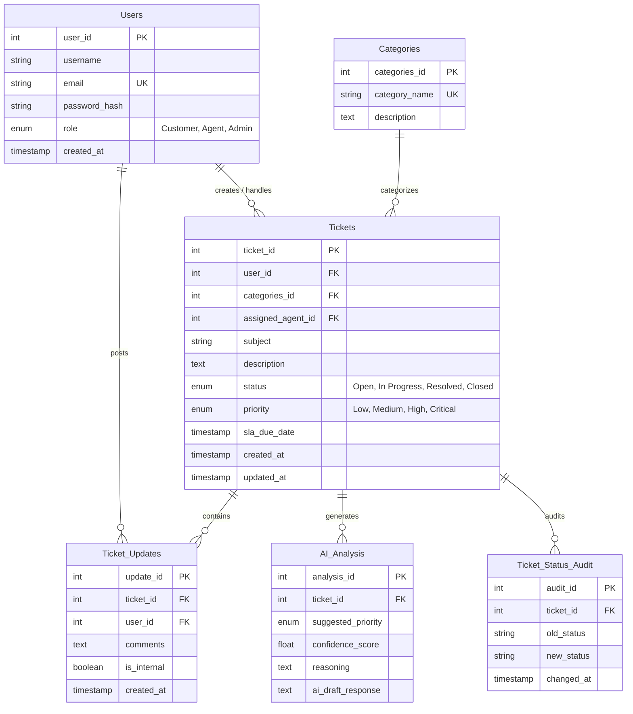

# 🚀 IntelliDesk: Intelligent Support Ticket System

An intelligent, full-stack customer support and ticketing system built as a Database Management Systems (DBMS) project. The system leverages a normalized MySQL database, an Express/Node.js backend integrated with Google Gemini AI for automatic ticket classification, and a modern React/Tailwind CSS v4 user interface.

---

## 📌 Project Overview
IntelliDesk streamlines customer support by using artificial intelligence to analyze, categorize, and prioritize tickets automatically. The system provides role-based interfaces with advanced database operations like stored procedures, triggers, and audit logging to manage operations efficiently.

### 👥 User Roles
1. **Customers**: Can log in, submit support requests under specific categories, view their dashboard, track SLA status, and converse in the ticket thread.
2. **Support Agents**: Access a dedicated queue panel displaying high-priority/critical tickets, view AI-suggested priorities, read AI-generated reasoning and drafts, update ticket status, and post private **Internal Notes** hidden from customers.
3. **Admins**: Manage users, categories, tickets, and run built-in database reporting routines.

---

## 🛠️ Tech Stack

### Frontend
- **Framework**: React.js (Vite)
- **Styling**: Tailwind CSS v4
- **Routing**: React Router DOM v7
- **HTTP Client**: Axios
- **Icons**: Lucide React

### Backend
- **Runtime**: Node.js & Express
- **Database Driver**: `mysql2/promise` (utilizing a connection pool)
- **Authentication**: JWT & Bcrypt password hashing
- **Configuration**: Dotenv for environment variables

### Artificial Intelligence
- **AI Core**: Google Gemini API via `@google/genai` SDK
- **Features**: Real-time sentiment analysis, auto-priority classification, confidence scoring, classification reasoning, and automated reply drafts.

### Database
- **Engine**: MySQL (normalized schemas, relational constraints, triggers, stored procedures, and views)

---

## 📊 Database Schema Design

The relational database consists of normalized tables designed to maintain high data integrity:



### ⚙️ Database Automation Features
- **Triggers**:
  - `UpdateTicketTimestamp`: Automatically updates the `updated_at` timestamp on a ticket when a new update or comment is posted.
  - `LogStatusChange`: Automatically logs state transitions into `Ticket_Status_Audit` whenever a ticket's status changes.
- **Stored Procedures**:
  - `CountInternalAgentNotes()`: Audits internal notes written by agents.
  - `FlagConfidenceAI()`: Automatically flags AI analysis tasks where the confidence score falls below $70\%$ for manual review.
  - `GenerateOpenTicketReport()`: Generates a real-time list of all open tickets.
- **Views**:
  - `agent_dashboard`: Filters high-priority and critical tickets along with customer information.
  - `ai_performance_summary`: Tracks the average confidence score and number of analyzed tickets per category.
  - `closed_tickets_archive`: Keeps an operational log of all resolved/closed tickets.

---

## ⚡ Getting Started

### Prerequisites
- Node.js (v18+)
- MySQL Server (v8.0+)
- Google Gemini API Key (for AI features)

### 1. Database Setup
Log in to your MySQL server and run the script schema to initialize the database:
```bash
# Connect to MySQL and import schema
mysql -u root -p < backend/schema.sql
```

### 2. Backend Configuration
Navigate to the `backend` directory and install dependencies:
```bash
cd backend
npm install
```
Create a `.env` file in the `backend/` directory:
```env
PORT=5001
DB_HOST=localhost
DB_USER=root
DB_PASSWORD=your_mysql_password
DB_NAME=Intelligent_System
GEMINI_API_KEY=your_gemini_api_key
JWT_SECRET=your_jwt_secret_token
```
Start the backend server in development mode:
```bash
npm run dev
```

### 3. Frontend Configuration
Navigate to the `frontend` directory and install dependencies:
```bash
cd ../frontend
npm install
```
Start the frontend development server:
```bash
npm run dev
```
Open your browser and navigate to `http://localhost:5173`.

---

## 📝 Demo Login Credentials
For testing purposes, you can use the following default credentials (passwords are pre-configured or default to `hashedpassword` / `your_configured_passwords` in database initialization):

| Role | Email | Password |
|---|---|---|
| **Customer** | `customer@example.com` | `hashedpassword` |
| **Agent** | `agent@example.com` | `hashedpassword` |
| **Admin** | `admin@example.com` | `hashedpassword` |

---

## 📁 Project Structure
```text
├── backend
│   ├── config/          # DB Pool Connection configuration
│   ├── controllers/     # API routes handling core queries
│   ├── routes/          # Express route declarations
│   ├── schema.sql       # MySQL Schema, Seeds, Views, and Procedures
│   ├── server.js        # Entry point for backend Express app
│   └── .gitignore
├── frontend
│   ├── src
│   │   ├── context/     # Auth state context provider
│   │   ├── pages/       # Login, Agent, and Customer dashboards
│   │   ├── App.jsx      # Core React routes and structure
│   │   ├── index.css    # Tailwind CSS imports & theme customization
│   │   └── main.jsx
│   ├── package.json
│   └── vite.config.js
├── Documentation/       # Technical Project specifications
└── README.md            # Project main documentation
```
